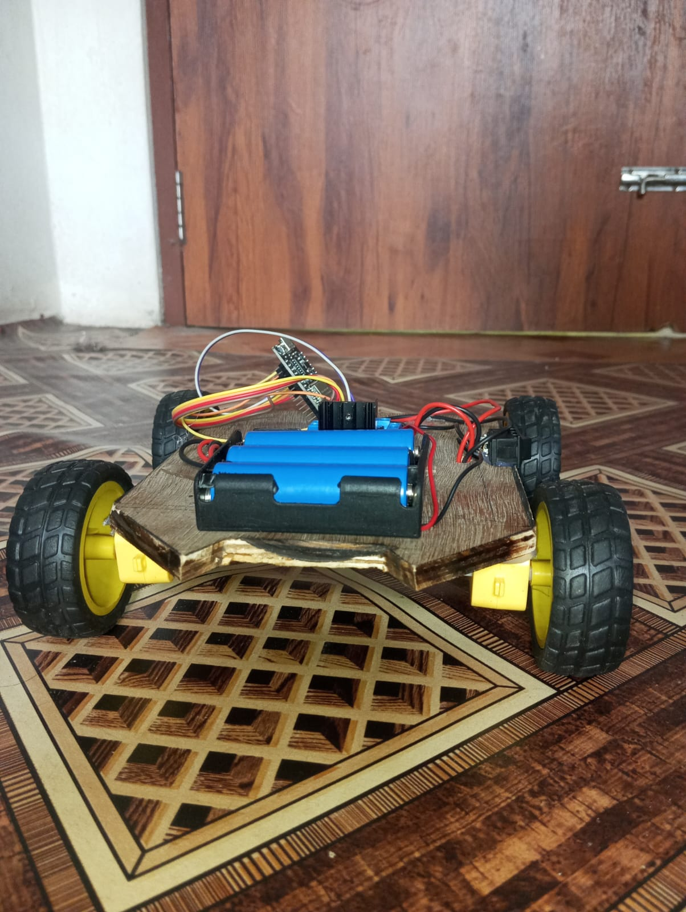
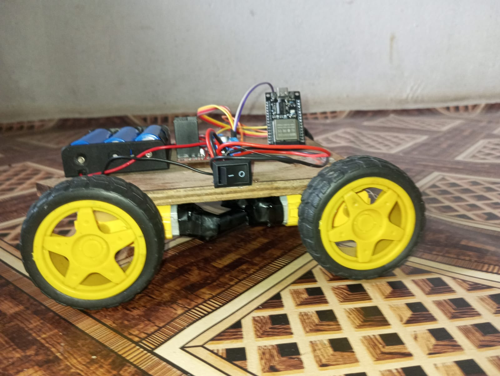
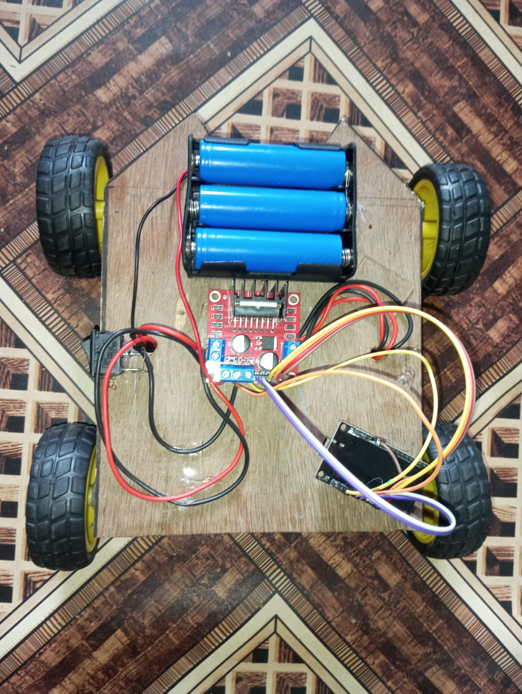

# Esp32 Robot Car
This is a robotic car which can be remotely controlled from bluetooth with the help of mobile phone . It is primarily powered by esp32 and L298N (or L293D) motor controller that supports all the basic movements such as backward, foreward, left/right and basic speed control.
## Car Image

### Front View

### Side View

### Top View

# features
- forward
- backward
- left
- right
- Stop
# Components
- ESP32 devkit v1
- L298N (or L293D) Motor Driver
- 4 DC motors
- Robot chassis
- 4 wheels
- Battery
- Power switch
- Jumper wires
## Bill of Materials

| S.no | Component | Quantity | Purchase |
|---|---|---:|---|
|1 | ESP32| 1 | [link](https://www.daraz.com.np/products/esp32-development-board-i511363277-s2291645002.html) |
|2 | L298 Motor Contoller| 1 | [link](https://www.daraz.com.np/products/l298-motor-driver-module-i29709-s92695.html) |
|3 | Motors and Wheels| 1 set | [link](https://www.daraz.com.np/products/dual-shaft-bo-motor-150-rpm-with-wheel-4-wheels-and-4-gear-motor-i127809502-s1034780469.html) |
|4 | Battery Holder| 1 | [link](https://www.daraz.com.np/products/black-plastic-1x-2x-3x-4x-18650-battery-storage-box-case-1-2-3-4-slot-way-diy-batteries-clip-holder-container-with-wire-lead-pin-i416807832-s1794727927.html) |
|5 | 18650 Battery| 3 | [link](https://www.daraz.com.np/products/lc-18650-3000mah-35v-battary-i100852775-s1021404307.html) |
|6 | Jumper Wires| 1 pack | [link](https://www.daraz.com.np/products/40-pieces-dupont-jumper-wire-cable-male-to-male-two-point-five-four-millimeter-20cm-breadboard-arduino-electronics-prototyping-for-men-i129084254-s1037084718.html) |
| 7 | On/Off Switch | 1 | [link](https://www.daraz.com.np/products/small-switch-i128943111-s1036882907.html) |

## Hardware Files

The hardware files for the robot are included in this repository.

# How It Works
The code is pushed to esp32(Which controls the motor driver) with suitable ide and then it is controlled with "Rc bluetooth controller" app from phone.
# Firmware Build & Flash Instructions

## Requirements

Install:

- Arduino IDE
- ESP32 Board Package
- Required libraries

## Installing ESP32 Board Support

1. Open Arduino IDE
2. Go to: File-->Preferences
3. Add ESP32 board URL:https://raw.githubusercontent.com/espressif/arduino-esp32/gh-pages/package_esp32_index.json
4. Open:Tools-->Board--->BoardManager and search esp32 and install:esp32 by Espressif Systems
## Firmware Compilation

1. Clone repository:https://github.com/theemperorpratik-png/Esp32-Robot-Car.git
2. Open firmware folder.
3. Open the .ino file using Arduino IDE.
4. Select board: Tools → Board → ESP32 Dev Module
5. select com part: Tools → Port → COMxx and click verify
now connect esp32 with usb c and press upload it will autoflash.

# Pin Configuration

| ESP32 Pin | Function              |
|-----------|-----------------------|
| GPIO13    | ENA (Left Motor PWM)  |
| GPIO12    | IN1                   |
| GPIO14    | IN2                   |
| GPIO15    | ENB (Right Motor PWM) |
| GPIO27    | IN3                   |
| GPIO26    | IN4                   |

# LIBRARIES USED

    - Arduino Framework
    - BluetoothSerial (ESP32)

# Schematic

# Credits
Code and schematic from "Krawfox(Arjun Khanal)"
